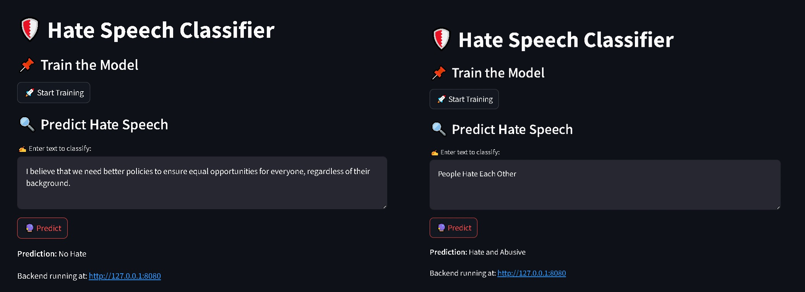

# Hate Speech Classification




## 📌 Project Overview
This project uses deep learning techniques to classify text as **Hate Speech** or **No Hate Speech**. The model is trained on a labeled dataset and utilizes various deep-learning architectures to achieve accurate predictions.

## 🛠️ Tech Stack
- **Programming Language**: Python
- **Deep Learning Framework**: TensorFlow/PyTorch
- **Web Framework**: Streamlit (for frontend), Flask/FastAPI (for backend)
- **Data Processing**: Pandas, Numpy, NLTK


## 📂 Project Structure
```
Hate-Speech-Classification/
│── src/
│   ├── config/
│   ├── components/
│   ├── pipeline/
│   ├── main.py
│── app.py
│── streamlit_app.py
│── config.yaml
│── params.yaml
│── requirements.txt
│── README.md
```

## 🔄 Workflows
1. **Update `config.yaml`** - Define the configuration settings.
2. **Update `secrets.yaml` (Optional)** - Store API keys or credentials securely.
3. **Update `params.yaml`** - Configure hyperparameters.
4. **Update the entity** - Define the data schema and classes.
5. **Update the configuration manager (`src/config/`)** - Manage project settings.
6. **Update the components** - Implement preprocessing, feature extraction, and modeling.
7. **Update the pipeline** - Construct the ML pipeline.
8. **Update `main.py`** - Define the execution flow.
9. **Update `app.py`** - Implement backend logic.

## 🚀 How to Run the Project?

### **Step 1: Clone the Repository**
```bash
https://github.com/PriyanshuDey23/Hate-Speech-Classification.git
```

### **Step 2: Create and Activate a Virtual Environment**
```bash
conda create -n cnncls python=3.8 -y
conda activate cnncls
```

### **Step 3: Install Dependencies**
```bash
pip install -r requirements.txt
```

### **Step 4: Run the Application**
#### **Backend**
```bash
python app.py
```
#### **Frontend**
```bash
streamlit run streamlit_app.py
```

---

## 📜 License
This project is licensed under the MIT License - see the [LICENSE](LICENSE) file for details.


---

This README provides a clean and structured overview of your project. Let me know if you need any modifications! 🚀

